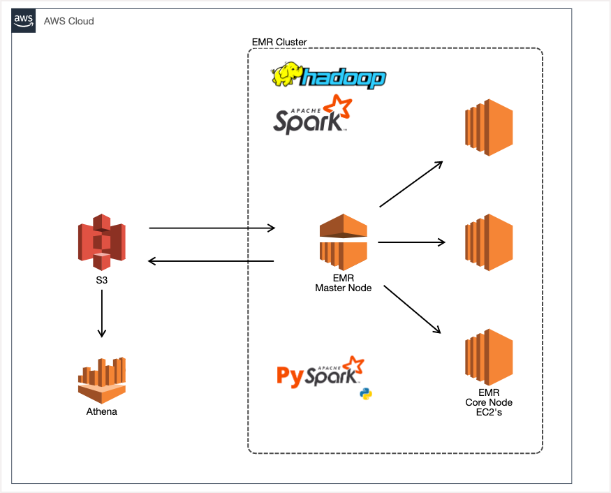
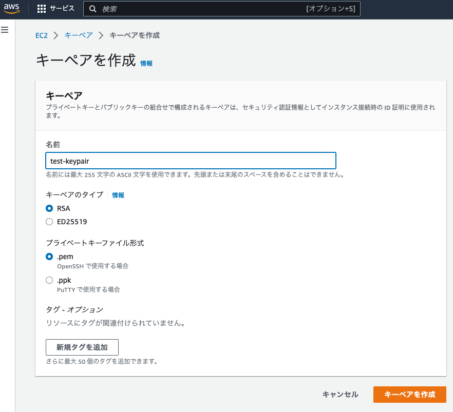
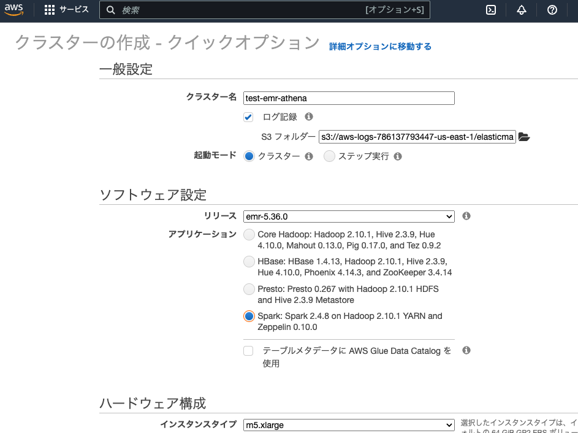
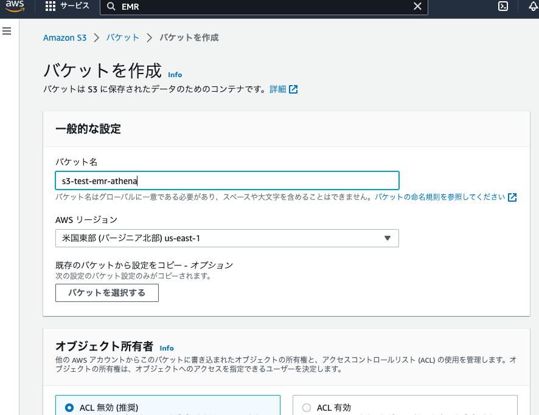
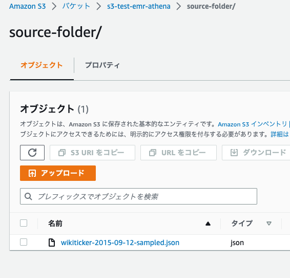
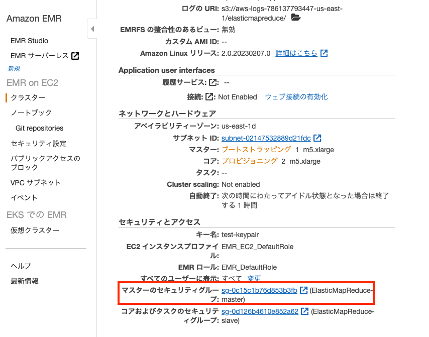
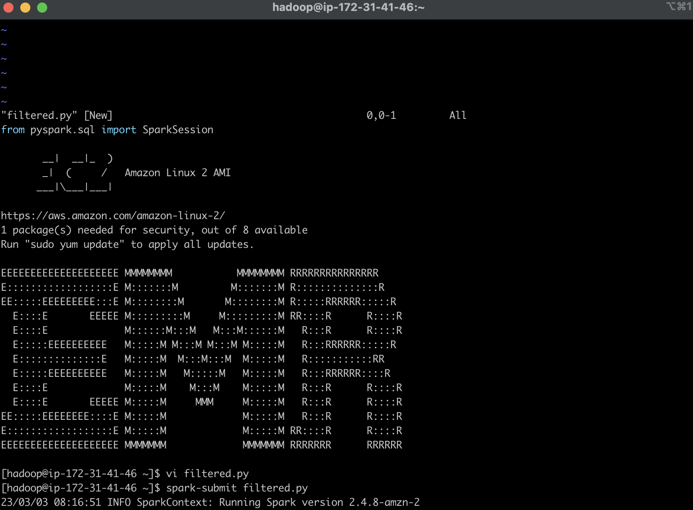
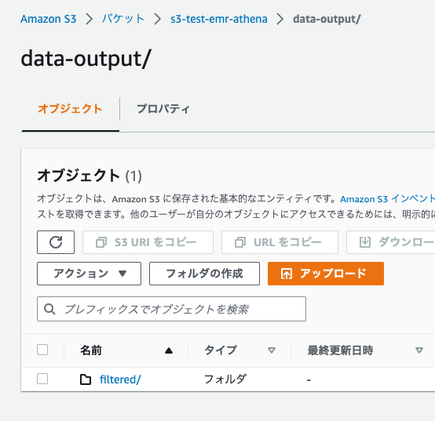
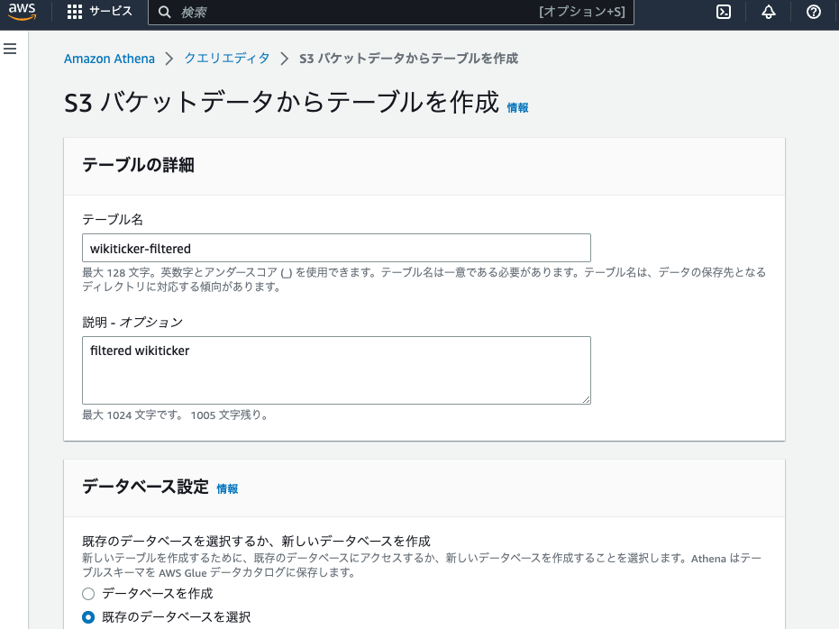
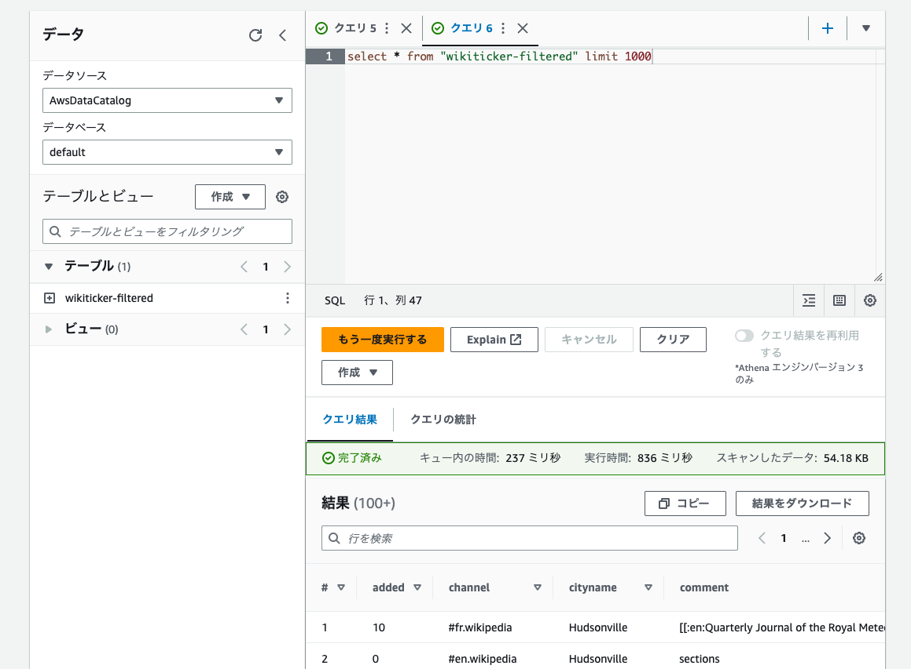

# AWS EMR, Athenaを利用したPySparkのバッチ処理　プロジェクト

## 概要
このプロジェクトでは、AWSサービス(ストレージ：S3、処理：EMR、処理された結果のクエリ：Athena) を使用して下記の流れでバッチ処理を行います。 

S3にデータセットを保存 ➡︎ EMRのPySparkで処理 ➡︎ 結果をS3に保存 ➡︎ AtenaでS3の結果をクエリ

以下は、今回のアーキテクチャです。




## ステップ
### ステップ1：データセットの準備
下記のURLの圧縮ファイルを解凍したJSONファイルを使います。

[Github apache/druid](https://github.com/apache/druid/blob/master/examples/quickstart/tutorial/wikiticker-2015-09-12-sampled.json.gz)

### ステップ2：EC2 キーペア作成
EC2 ➡︎ ネットワーク＆セキュリティ ➡︎ キーペア と選択しキーペアを作成し、作成後にダウンロードされるpemファイルを保管しておきます。

 

### ステップ3：EMRクラスターの作成
EMR ➡︎ クラスター作成 からクラスターを作成します。

設定内容
* EMRのログを保存するためにS3バケットが必要です。デフォルトで設定があり自動でバケット作成をしてくれるのでデフォルトのままにします。
* ソフトウェア設定は「Spark: Spark ○.○.○ on Hadoop ○.○.○ YARN and Zeppelin ○.○.○」を選択
* ハードウェア構成もデフォルト設定で問題ないのでデフォルトのままにします。注意：デフォルトでは「自動終了を有効化」にチェックがありアイドル状態が一時間ほど続くとクラスターが終了します。
* セキュリティとアクセスのEC2 キーペアで先ほど作成したEC2 キーペアを選択します。

  

この設定でクラスターを作成します。

### ステップ4：S3 バケットとフォルダーを作成しデータセットを格納
S3 ➡︎ バケット作成 からバケットを作成します。

設定はデフォルトのままで良いですがお好みでバケットのバージョニングなど変更してください。

  


バケット作成後、作成したバケット ➡︎ フォルダ作成から下記のフォルダを作成します。
* source-folder (データセットを格納)
* data-output (EMRでの処理結果を格納)

source-folder ➡︎ アップロードからデータセットをsource-folderフォルダにアップロードします。

   


### ステップ5：PySparkコードを準備
下記２つのコードを用意。

[filtered.py](codes/filtered.py)

[aggregated.py](codes/aggregated.py)

このコードでやっていること

filtered.py
* S3からのデータ読み込み
* 特定の条件でデータを抽出
* スキーマを出力（Athenaの設定の際に利用）
* S3のdata-outputフォルダにfilteredフォルダを作りその中にParquetで出力

aggregated.py
* S3からのデータ読み込み
* 特定の条件でデータを集計
* スキーマを出力（Athenaの設定の際に利用）
* S3のdata-outputフォルダにaggregatedフォルダを作りその中にParquetで出力

### ステップ6：SSHでEMRに接続し、PySparkでS3のデータセットを処理
> EMR クラスターにSSH接続しようとする前に、マスターセキュリティグループからポート22のSSH接続が有効になっているか確認してください。

 

* EMR ➡︎ クラスター ➡︎ 作成したクラスターを選択 ➡︎ まとめタブのマスターパブリック DNS　の「Connect to the Master Node Using SSH」をクリックし表示されるSSHコマンドでキーペアのファイルパスを修正しSSHコマンドを実行し接続します。

* `vi filtered.py` コマンドで、Vimエディタを使用してPythonファイルを作成します。
* [filtered.py](codes/filtered.py) の内容を書き込み、保存して終了します。
* `spark-submit [ファイル名]` コマンドでジョブを実行します。注意：コマンドに出力されているスキーマ情報をどこかにメモしておきます。

 

* PySparkの処理が完了するとS3のdata-outputフォルダ内にfilteredフォルダが作成されその中に処理後のデータが出力されています。

 

* aggregated.pyもfiltered.pyと同様の操作で実行します。
* PySparkの処理が完了するとS3のdata-outputフォルダ内にaggregatedフォルダが作成されその中に処理後のデータが出力されています。

### ステップ7：AthenaでS3の処理結果をクエリする
* Athena ➡︎ クエリエディタを起動 を選択しデータベースで「default」を選択されていることを確認しテーブルとビューの横の作成から「S3バケットデータ」を選択しテーブルを作成する。

設定内容
* テーブル名を入力し説明は任意で入力します。
* データベースでdefaultが選択されていることを確認します。
* データセットのS3を参照からdata-outputフォルダ内のfilteredフォルダを選択します。
* 列の詳細の「列の一括追加」を選択しステップ6でメモしたスキーマを基に列の情報を入力し、他はデフォルトのまま作成します。



* Athenaで下記のクエリを実行しデータがあることを確認します。
``` SQL
select * from "{TABLE_NAME}" limit 1000
``` 



* aggregatedフォルダに入っている処理結果も同様の操作でAthenaからテーブル作成することができます。


